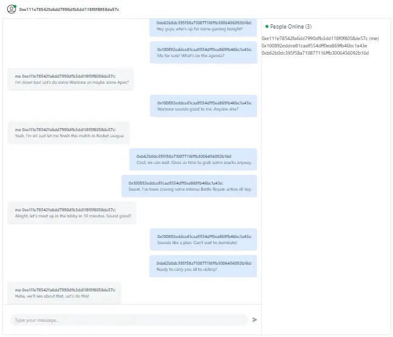

# Real-time Chat with Metamask integration

## See app [Demo](https://real-time-chat-metamask.vercel.app/)

This is a public chat allows users to exchange messages by connecting their crypto wallet. Wallet address is used as the username in chat.

## Pre-requirements

- Metamask wallet or any other crypto wallet

## Stack
1. Ably
2. NextJS
3. Tailwind CSS
4. Metamask
5. Vercel

## Run App Locally
1. `git clone`
2. `cd real-time-chat-app`
2. `npm install`
3. setup `.env` file with Ably API Key
4. `npm run dev`

## Free Ably Account limits:

Quota | Allocation (per month)
--- | --- |
Messages total | 3,000,000
Data transferred | 5.72 GiB
Peak connections | 100
Peak channels | 100

## Hosting
Vercel
