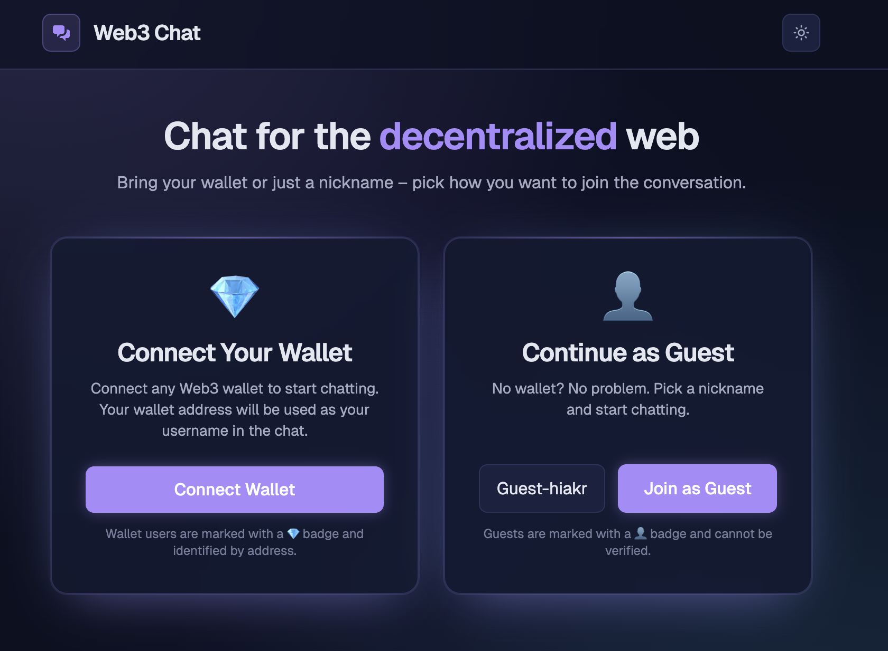
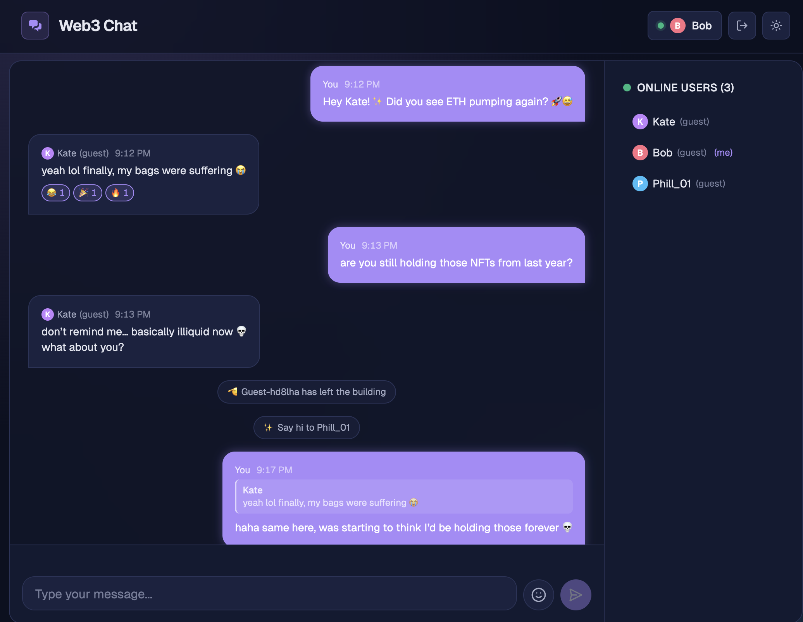

# Web3 Real-time Chat

[Live Demo](https://real-time-chat-metamask.vercel.app/)

A public real-time chat with two ways to join: connect a Web3 wallet (MetaMask, Coinbase Wallet, Rabby, etc.) or pick a nickname and continue as a guest. Wallet users get on-chain identity features - ENS names, chain badges, signature-verified ✓, and direct ETH tipping, while guests can chat right away with no setup. 

## Preview


*Pick how you want to join - wallet or guest nickname*


*Real-time chat with wallet-based identities, reactions, replies and more*

## Features

### Authentication & identity
- **Wallet login** - Connect MetaMask or any injected Web3 wallet; address is used as your identity.
- **Guest login** - No wallet? Pick a nickname and join. An auto-suggested nickname is offered on first visit.
- **SIWE-style verification** - Wallet users sign a Sign-In with Ethereum message at login; peers locally verify the signature and show a green ✓ next to verified addresses. No backend involved.
- **ENS names** - Reverse-resolves `address → name.eth` against mainnet, with in-memory + `localStorage` caching (24h TTL) and request deduplication.
- **Identicons** - Deterministic Jazzicon avatars for wallets, colored initial bubbles for guests.
- **Etherscan deep links** - Clicking any wallet name opens that address on the matching chain explorer.

### Chat experience
- **Real-time messaging** via Ably v2 — chat, typing, reactions and presence run on separate channels (`chatroom`, `typing`, `reactions`, `headlines`) so transient events never pollute message history.
- **Online presence** - Live member sidebar with multi-tab/multi-device deduplication.
- **Join / leave system messages** - Discord-style randomized "X joined", "Y waved goodbye" pills.
- **Replies / quotes** - Reply to any message; click the quote to jump to the original with a flash highlight.
- **Emoji reactions** - Quick-pick reaction bar on hover; reactions are aggregated and toggleable per user.
- **Typing indicator** - Throttled "X is typing…" / "N people are typing" with auto-expiry.
- **Emoji picker** - Curated, dependency-free picker grouped by category.
- **Markdown subset** - Fenced code blocks, inline `code`, **bold**, *italic*, with safe URL linkification (no `dangerouslySetInnerHTML`).
- **Timestamps** - Short HH:MM in the bubble, full date on hover.
- **Message safety** - Control / zero-width / direction-override character stripping, length cap (2000 chars) with live counter, and a sliding-window client-side rate limit (5 sends per 10s).

### Web3 utilities
- **Chain badges** - Detects the wallet's current EVM network (Ethereum, Polygon, Base, Arbitrum, Optimism, BNB, Avalanche, Fantom, Sepolia, Base Sepolia, …) and shows a colored pill in the sidebar; updates live on `chainChanged`.
- **ETH tipping** - Send a native-coin tip to any other wallet user directly through MetaMask, with chain-aware ticker (ETH/MATIC/BNB/…) and a link to the tx on the matching block explorer.

### UI / UX
- **Dark / light theme toggle** with no-flash initial paint and `localStorage` persistence.
- **Responsive layout** - Two-column desktop chat, stacked mobile layout, auto-growing textarea, iOS-zoom-safe inputs.
- **Privacy first** - No database, no analytics, no third-party cookies. All identity state lives in `localStorage` / `sessionStorage` on the user's device. The Ably API key only leaves the server via short-lived token requests.

## How to use

1. Open the app in your browser.
2. Either:
   - Click **Connect Wallet** and approve in MetaMask (optionally sign the SIWE message to get the ✓ badge), **or**
   - Pick a nickname and click **Join as Guest**.
3. Chat in real time. Hover a message for reactions / reply, click a wallet name to open Etherscan, or click **💸 Tip** next to another wallet user to send them ETH.

## Requirements

- A modern web browser.
- For wallet features: MetaMask, Coinbase Wallet, Rabby, or any other injected Web3 wallet. (Optional - guests can chat without one.)

## Local development

```bash
npm install
# Provide an Ably API key (server-side only - never exposed to the browser)
echo "ABLY_API_KEY=your-ably-key" > .env.local
npm run dev
```

Other scripts:

- `npm run build` - production build
- `npm run start` - run the production build
- `npm run lint` - ESLint
- `npm test` - Playwright end-to-end tests (`npm run test:headed` / `npm run test:report`)

## Tech Stack
- **Next.js 16** (App Router) + **React 19**
- **Ably v2** - real-time messaging and presence via React hooks (`useChannel`, `usePresence`)
- **Ethers.js v6** - wallet provider, SIWE signature verification, tipping, ENS reverse lookup
- **react-jazzicon** - deterministic wallet avatars
- **Tailwind CSS v4** - styling
- **Playwright** - end-to-end tests
- **Vercel** - deployment

