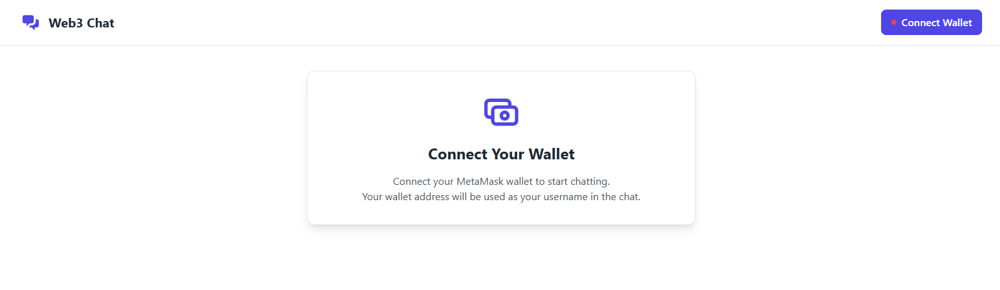
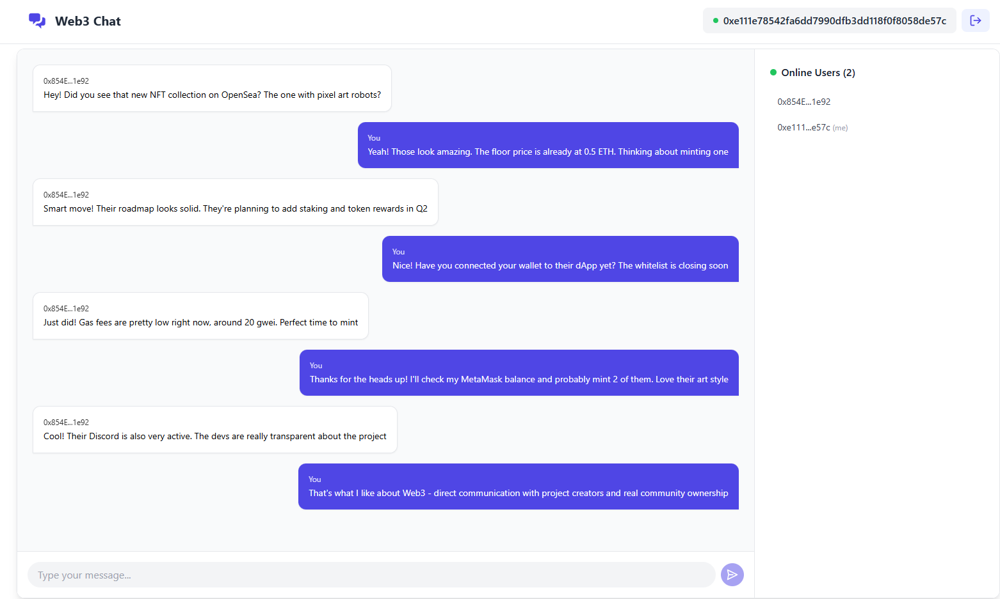

# Web3 Real-time Chat

This is a public chat allows users to exchange messages by connecting their crypto wallet. Wallet address is used as the username in chat. [Live Demo](https://real-time-chat-metamask.vercel.app/)

## Preview

*Simple one-click wallet connection*

*Real-time chat with wallet-based identities*

## Features

- **Easy Authentication**: Connect with MetaMask - no passwords needed
- **Real-time Messaging**: Instant message delivery and updates
- **Web3 Identity**: Your wallet address serves as your unique username
- **Online Status**: See who's currently active in the chat
- **Privacy First**: No data collection or storage - your wallet address is only used for display purposes. No databases, no tracking, no third-party cookies. Pure Web3 privacy.

## Try it now

Visit [Live Demo](https://real-time-chat-metamask.vercel.app/) to start chatting.

## How to use

1. Visit the app in your browser
2. Click "Connect Wallet" and approve the MetaMask connection
3. Start chatting with other Web3 users

## Requirements

- MetaMask or any other Web3 wallet
- A modern web browser

## Tech Stack
- Next.js - React framework
- Ably - Real-time messaging
- TailwindCSS - Styling
- Ethers.js - Ethereum wallet integration
- Vercel - Deployment

